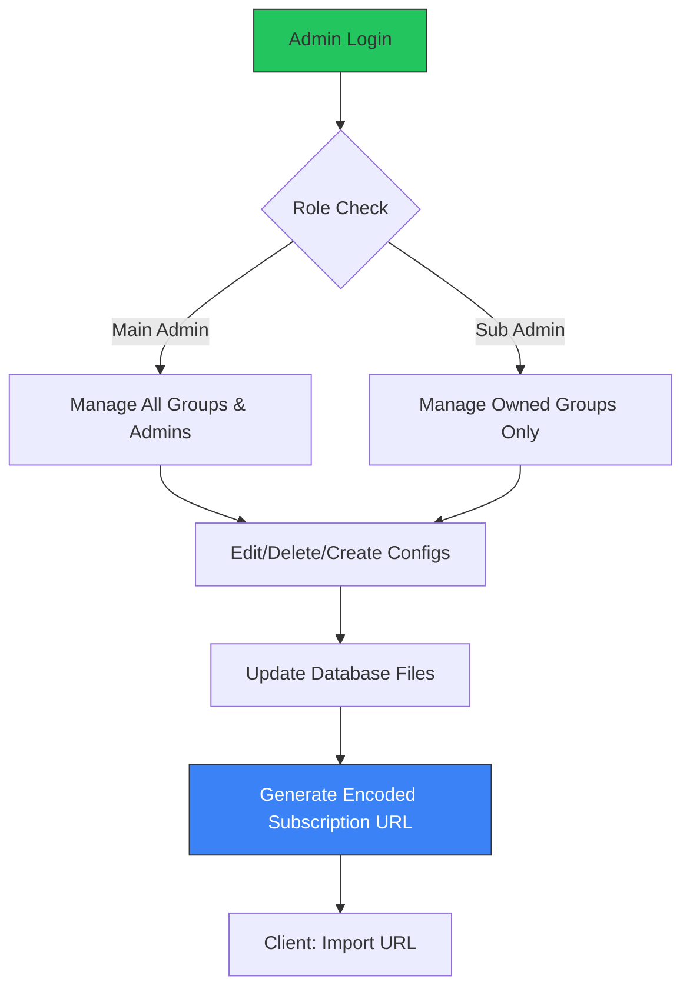

# 🍁 Maple Config Manager

<p align="center">
  
  
  
  
</p>

<p align="center">
  <strong>A professional-grade backend for distributing and managing proxy configurations.</strong>
  <br />
  Designed for administrators to securely categorize, distribute, and monitor proxy clusters with real-time X-UI integration.
</p>

---

## 📖 Overview

**Maple Config Manager** is a robust PHP-based subscription management system. It enables administrators to organize complex proxy configurations (VMess, VLESS, Trojan, etc.) into secure, password-protected groups. It provides a standardized URL-based "Subscription" feed that integrates seamlessly with modern proxy clients like *v2rayNG* and *Nekoray*.

---

## 🛠️ Key Features

*   **Group-Aware Management:** Organize configurations by owner or group, making it ideal for multi-admin environments.
*   **Sub-Admin Delegation:** Create dedicated sub-admin accounts with isolated management privileges using secure UUID authentication.
*   **Real-time X-UI Monitoring:** Integrates a built-in scraper that fetches statistics from **X-UI panels**, displaying remaining data (GB), total quota, and time remaining directly in the management dashboard.
*   **Dynamic Feed Generation:** Automatically produces base64-encoded subscription feeds compatible with all industry-standard proxy protocols.
*   **Access Control:** Toggle between "Free" (public access) and secure (password-protected) configurations.
*   **Zero-Database Complexity:** Operates on a highly efficient flat-file database architecture, ensuring portability and ease of backup.

---

## 🧬 System Logic



---

## 🚀 Installation & Setup

### 1. Requirements
*   **Web Server:** PHP 7.4 or higher.
*   **File Permissions:** This system utilizes two flat-file databases (`database.txt` and `admins.txt`). You must create these files and ensure they are writable by your web server (e.g., `www-data` or `apache`).

1. Create the files:
   ```bash
   touch database.txt admins.txt
   ```
2. Set appropriate permissions:
   ```bash
   chmod 666 database.txt admins.txt
   ```

### 2. Initial Configuration
*   **Initial Login:** After uploading, access the script via your browser. Use the following default credentials to log in:
    *   **Main Admin UUID:** `admin_12341234`
    *   **Password:** `12341234`
*   **Security:** Navigate to the admin panel immediately to create new admin users.

---

## 📊 X-UI Integration & Stats Scraper

The statistics monitoring logic is powered by a robust scraper developed by [Captanx52](https://github.com/Captanx52). This engine uses `cURL` with spoofed User-Agents to fetch real-time usage data from your X-UI panels.

**Customizing the Scraper:**
If your X-UI panel version or structure differs, you can modify the parsing logic within the `get_data_from_url` function in `index.php`:

```php
function get_data_from_url($url) {
    // ... logic for cURL and response handling
    // Adjust this Regex pattern based on your panel's HTML output:
    if (preg_match_all('/(\d+(?:\.\d+)?)\s*(GB|MB)/i', $response, $matches)) {
        // ... calculation logic
    }
}
```

---

## 🛠️ Technical Specifications

| Feature | Implementation |
| :--- | :--- |
| **Authentication** | Secure comparison with session-based UUID tracking |
| **Data Integrity** | `LOCK_EX` file locking to prevent race conditions during write operations |
| **Data Scraping** | cURL-based engine with spoofed User-Agents for panel compatibility |
| **Format** | Base64 encoded subscription stream |

---

## 📜 License

Distributed under the **MIT License**. This software is intended for legitimate network management and administrative use.

---
<p align="center">
  Optimized configuration management for modern infrastructure. 🍁
</p>
